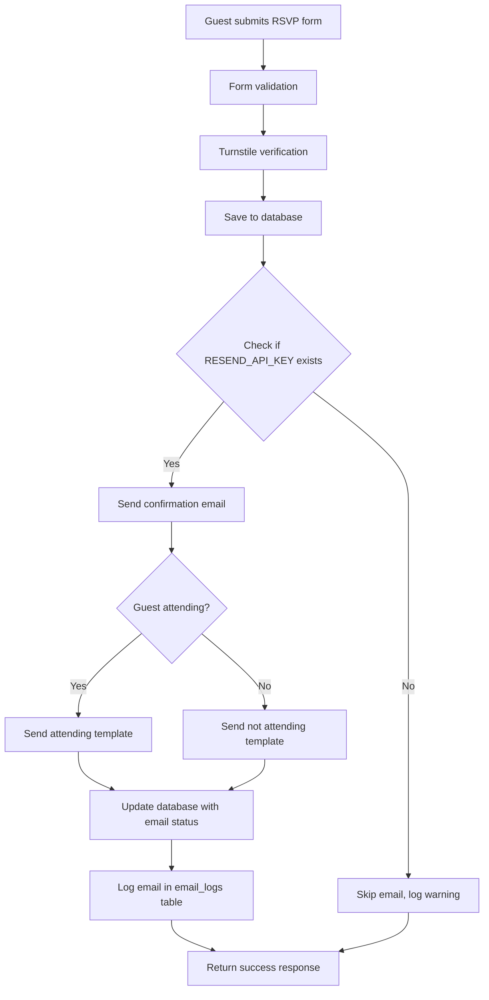

# Email Notification System - Full Implementation Guide

## Overview

The Amanda & Ray wedding website includes a comprehensive email notification system that automatically sends confirmation emails to guests when they RSVP and allows administrators to send bulk updates to all confirmed guests.

## Architecture

### Technology Stack
- **Email Service Provider**: Resend API
- **Database**: Cloudflare D1 (SQLite)
- **Runtime**: Cloudflare Workers (Edge Runtime)
- **Framework**: Next.js with App Router

### Key Components

```
/app/services/email/
├── email-service.ts         # Core email service class
└── templates/
    ├── confirmation-attending.ts      # Template for guests who are attending
    ├── confirmation-not-attending.ts  # Template for guests who can't attend
    └── update-template.ts            # Template for bulk updates

/app/api/
├── rsvp/route.ts           # RSVP endpoint that triggers confirmation emails
└── admin/send-update/      # Admin endpoint for bulk email updates
```

## Email Flow Logic

### 1. RSVP Confirmation Flow



### 2. Email Service Implementation

```typescript
// email-service.ts structure
export class EmailService {
  private resend: Resend
  private fromEmail: string = 'noreply@amanda-ray-wedding.com'
  private fromName: string = 'Amanda & Ray'

  constructor(apiKey: string) {
    this.resend = new Resend(apiKey)
  }

  async sendRSVPConfirmation(data: EmailData): Promise<EmailResult> {
    // 1. Select template based on attendance
    // 2. Send email via Resend API
    // 3. Return success/failure with message ID
  }

  async sendUpdateEmail(emails: string[], subject: string, content: string): Promise<EmailResult[]> {
    // 1. Generate HTML template
    // 2. Batch process emails with rate limiting
    // 3. Return array of results
  }
}
```

## Database Schema

### Email Tracking Columns in `rsvps` Table
```sql
-- Tracks email confirmation status for each RSVP
confirmation_email_sent BOOLEAN DEFAULT FALSE
confirmation_email_sent_at DATETIME
confirmation_email_id TEXT  -- Resend message ID
```

### Email Logs Table
```sql
CREATE TABLE email_logs (
  id INTEGER PRIMARY KEY AUTOINCREMENT,
  rsvp_id INTEGER,
  email_type TEXT NOT NULL,           -- 'confirmation', 'update', etc.
  recipient_email TEXT NOT NULL,
  subject TEXT NOT NULL,
  sent_at DATETIME DEFAULT CURRENT_TIMESTAMP,
  status TEXT NOT NULL,               -- 'sent', 'failed', 'pending'
  message_id TEXT,                    -- Resend message ID
  error_message TEXT,
  FOREIGN KEY (rsvp_id) REFERENCES rsvps(id)
);
```

## Email Templates

### Template Structure
All email templates follow a consistent structure:
- HTML email with inline CSS
- Responsive design (max-width: 600px)
- Wedding color scheme matching the website
- Personalized greeting using guest name
- Clear call-to-action buttons

### Template Variables

#### Confirmation Attending Template
```typescript
interface EmailData {
  guestName: string       // Used in greeting
  email: string          // Recipient
  attending: boolean     // Determines template selection
  plusOneName?: string   // Shows in RSVP details
  songRequests?: string  // Shows in RSVP details
  bookedRoom?: boolean   // Shows booking status
}
```

#### Update Template
```typescript
// Simple template that wraps admin-provided content
updateEmailTemplate(content: string): string
```

## API Endpoints

### POST /api/rsvp
Handles RSVP submission and triggers confirmation email:

```typescript
// Simplified flow
1. Validate form data with Zod schema
2. Verify Turnstile token
3. Insert/update RSVP in database
4. If RESEND_API_KEY exists:
   - Send confirmation email
   - Update rsvps table with email status
   - Log attempt in email_logs table
5. Return response with emailSent flag
```

### POST /api/admin/send-update
Sends bulk updates to all confirmed guests:

```typescript
// Request body
{
  subject: string,
  content: string,
  testMode?: boolean  // Limits to 5 recipients for testing
}

// Process
1. Query all attending guests from database
2. Send emails in batches with rate limiting (100ms delay)
3. Log each attempt in email_logs table
4. Return summary of successes/failures
```

## Configuration

### Environment Variables
```env
RESEND_API_KEY=re_xxxxxxxxxxxxx  # Required for email functionality
```

### Resend Configuration
1. Add and verify domain in Resend dashboard
2. Configure DNS records as instructed by Resend
3. Update `fromEmail` in email-service.ts to use verified domain

## Error Handling

### Email Service Errors
- Catches and logs all Resend API errors
- Returns structured error responses
- Continues processing other emails in bulk operations
- Stores error messages in email_logs table

### Database Failures
- Email sending failures don't block RSVP submission
- System continues to function without email if RESEND_API_KEY is missing
- All email attempts are logged for debugging

## Rate Limiting

The bulk email sender implements a simple rate limiter:
```typescript
// 100ms delay between emails to respect Resend limits
await new Promise(resolve => setTimeout(resolve, 100))
```

## Testing

### Test Script
A test script is provided at `/test-email.js`:
```javascript
// Configure with your test values
const RESEND_API_KEY = 'your_resend_api_key_here'
const FROM_EMAIL = 'hello@your-domain.com'
const TEST_EMAIL = 'test@example.com'

// Run with: node test-email.js
```

### Testing Workflow
1. Set up test environment variables
2. Use `testMode: true` in bulk sends to limit recipients
3. Check email_logs table for debugging
4. Verify Resend dashboard for delivery status

## Security Considerations

### Current Implementation
- ✅ Turnstile verification on RSVP submissions
- ✅ Input validation and sanitization
- ✅ SQL injection protection via parameterized queries
- ⚠️ Admin endpoint lacks authentication (TODO)

### Recommended Improvements
1. Add authentication to admin endpoints
2. Implement CSRF protection
3. Add rate limiting to RSVP endpoint
4. Consider email verification for RSVP submissions

## Monitoring

### Key Metrics to Track
- Email delivery success rate
- Failed email attempts
- Average send time
- Bounce/complaint rates (via Resend dashboard)

### Database Queries for Monitoring
```sql
-- Check email success rate
SELECT 
  status,
  COUNT(*) as count,
  (COUNT(*) * 100.0 / (SELECT COUNT(*) FROM email_logs)) as percentage
FROM email_logs
GROUP BY status;

-- Find failed emails
SELECT * FROM email_logs 
WHERE status = 'failed' 
ORDER BY sent_at DESC;

-- Check guests without confirmation emails
SELECT * FROM rsvps 
WHERE attending = 1 
AND confirmation_email_sent = 0;
```

## Troubleshooting

### Common Issues

1. **Emails not sending**
   - Check RESEND_API_KEY is set
   - Verify domain in Resend dashboard
   - Check email_logs table for errors

2. **Rate limit errors**
   - Increase delay in bulk sender
   - Use Resend's batch API (future enhancement)

3. **Template rendering issues**
   - Test templates with various data combinations
   - Ensure all optional fields handle null/undefined

### Debug Mode
Enable detailed logging by checking the dev tools:
```typescript
devLog('Email service action', data)  // Logs in development
devError('Email error', error)        // Logs errors
```

## Future Enhancements

1. **Email Verification**: Add double opt-in for RSVP submissions
2. **Template Preview**: Admin UI to preview emails before sending
3. **Scheduling**: Allow scheduling of bulk emails
4. **Analytics**: Track open rates and click-through rates
5. **Internationalization**: Support for Spanish email templates
6. **Webhook Integration**: Handle Resend webhooks for delivery status

## Maintenance Checklist

- [ ] Regularly check email_logs for failed attempts
- [ ] Monitor Resend dashboard for bounce rates
- [ ] Update email templates for any wedding detail changes
- [ ] Test email flow after any code updates
- [ ] Clean up old email logs periodically
- [ ] Review and update rate limits based on usage